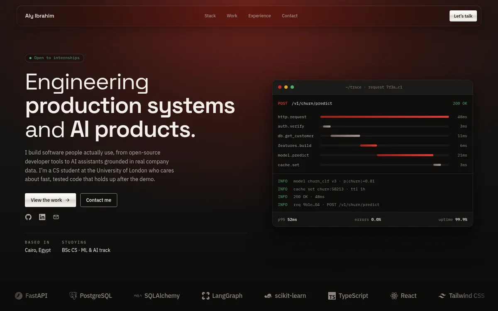

# Portfolio

My personal developer portfolio — a single-page site built from a hand-written
design system, migrated to React and TypeScript, and deployed to GitHub Pages.

**Live site:** https://alyibrahim1.github.io/portfolio/



## Highlights

- **A design system first.** Tokens, component specs and static previews live in
  `design-system/`, and the React components are built against them.
- **A contact form with no backend.** Messages post to Web3Forms from the page,
  so the static site can send email without a server.
- **Accessibility built in.** Semantic landmarks, a keyboard-navigable project
  dialog with focus return, `aria-current` section tracking, and a
  `prefers-reduced-motion` hook.
- **Deployed on every push.** GitHub Actions lints, tests and builds before it
  publishes, so a broken commit never reaches the live site.

## Stack

React 19 · TypeScript 5.9 · Vite 7 · Vitest · ESLint · GitHub Actions

## Getting started

Requires Node.js 20.19+ or 22.12+ (the version Vite 7 needs).

```bash
npm install
npm run dev      # http://localhost:5173
```

## Scripts

| Command | What it does |
|---|---|
| `npm run dev` | Start the dev server |
| `npm run build` | Typecheck, then build to `dist/` |
| `npm run preview` | Serve the production build locally |
| `npm run lint` | Lint `src` and the Vite config |
| `npm run test` | Run the tests in watch mode |
| `npm run test:run` | Run the tests once (used by CI) |

## Project structure

```
design-system/     Tokens, component specs, previews and the prototype bundle
src/
  components/      atoms → molecules → organisms → sections
  data/portfolio.ts  All page content in one place
  hooks/           Active-section tracking, reduced-motion
  pages/           PortfolioPage
  styles/app.css   Page-level styles on top of the design system
```

Page content — projects, timeline, stack and profile — is data, not markup. To
change what the site says, edit `src/data/portfolio.ts`.

## Deployment

Pushing to `main` triggers `.github/workflows/deploy.yml`, which installs,
lints, tests, builds and publishes `dist/` to GitHub Pages. Assets are served
from `/portfolio/`, set by `base` in `vite.config.ts`.

## License

MIT — see [LICENSE](LICENSE).
